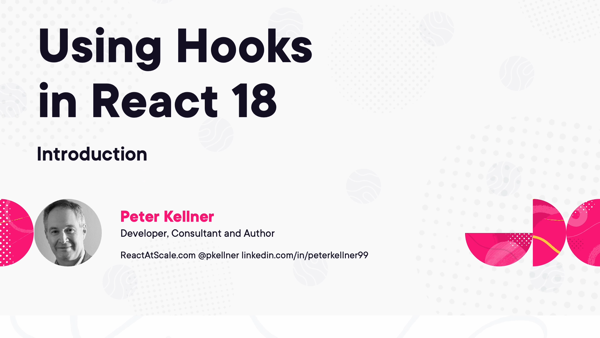

# Course Code for [Using React Hooks](https://pluralsight.com/courses/using-react-hooks) on Pluralsight

# IMPORTANT NOTICE: Updated Course: [Using Hooks in React 18 (Released Nov 2022)](https://pluralsight.com/courses/react-18-using-hooks)

This new course **"Using Hooks in React 18"** covers all the React Hooks covered in **this course** as well as the new React
Hooks `useTransition` and `useDeferredValue`. The new course incorporates a lot of feedback from this course including more focus 
on React and less focus on the build chain NextJS. That is, there is no discussions about deployments or server-side rendering.

There is nothing inaccurate in this course regarding hooks, the newer course is improved and more up to date in all regards.

# Recently Released Courses From Peter Kellner

| **Course**                                                                           | Release Date  |
|--------------------------------------------------------------------------------------|---------------|
| **[Server Component Fundamentals in React 18](http://www.pluralsight.com/courses/react-18-server-component-fundamentals)**    | June 2023     |
| **[Working with Components in React 18](https://pluralsight.com/profile/author/peter-kellner)**                | February 2023 |
| **[Using Hooks in React 18](https://pluralsight.com/courses/react-18-using-hooks/)** | November 2022 |
| **[What is React](https://pluralsight.com/courses/react-what-is/)**                  | August 2022   |
| **[What's New in React 18](https://pluralsight.com/courses/react-18-whats-new/)**    | May 2022      |
| **[Data and UI Patterns in React](https://github.com/pkellner/pluralsight-building-essential-ui-data-elements-in-react/)**    | December 2021      |

Before you start, you should install node on either your Windows or Mac computer (those are the two environments that are tested). Below, in
"Getting Started" are the basics to get module 6 up and running as fast as possible.

## Course Description

React versions 17.0.2 and higher, include React Hooks which solve several problems that went unaddressed in previous versions. React Hooks provide a direct API to React concepts you already know about. Those concepts include props, state, context, refs and lifecycle events. React Hooks are designed for use in React Functional Components where previously there was no good way to manage state or lifecycle events.

In this course, you’ll learn how to use the top seven React Hooks as well as gain the knowledge and experience necessary to build your own customized composite Hook. Along the way, you’ll pick up techniques you can use building real world web apps that include how React Hooks can help you with REST services, reducers, authentication and more.

When you are finished with this course, you’ll confidently be able to combine functional components with React Hooks to build first class React apps. Those apps can be written completely with functional components and React Hooks.

## Getting Started
1. **Install [Node 14.16 with NPM 7.9](https://nodejs.org)**. 
2. **Clone this repository.** - `git clone https://github.com/pkellner/pluralsight-course-using-react-hooks` or [download the zip](https://github.com/pkellner/pluralsight-course-using-react-hooks/archive/master.zip)
3. **Set your default directory to which module you want (example: cd 02-Basic-React-Hooks-useState-useRef-useEffect - `cd m6-add-rest-data-to-server-side-rendering`
4. **Install Node Packages with Dependencies.** - `npm install`
5. **Install [this chrome extension](https://chrome.google.com/webstore/detail/nextjs-utilities-extensio/ffcogmoganomoabikgmcmckdgojnpldo) for viewing performance data (optional).**

## Directory Structure Here

Each of the 5 folders here represent one module of the course.  In each folder, there are subfolders that represent the completed code at the end of each clip. Where this is no clip reference, either there is no code in that clip or nothing changed from the previous clip.

Once in a clip directory, the easiest way to test the app is to first install the packages by typing at the root of that directory (in a terminal window or DOS prompt)

`npm install`

Then, do run the app you just need type

`npm run dev`

And that will launch the web server on port 3000 where you can browser to it at the url: `http://localhost:3000`

## Background

This course uses the Next.js framework as a demonstraton vehicle for React Hooks. If you want to know more about Next.js you should watch my other course on Pluralsight titled "Building Server-side Rendered React Apps for Beginners". You can find it [here](https://www.pluralsight.com/courses/building-server-side-rendered-react-apps-beginners). 

## Repo or Course Issues

If you find any problems or issues, feel free to post it as an issue here at this forum and I will look into it as soon as I can. You can also contact me directly at https://peterkellner.net/contact/ 

I hope you enjoy the course!

## Notes

[Update Notes for April 2021 Release](https://github.com/pkellner/pluralsight-course-using-react-hooks/blob/master/April2021-Update-Notes.md)

If you want to get to the source code from the previous course release
in April 2020, you can find it in the branch named
[Course-Update-July-2020](https://github.com/pkellner/pluralsight-course-using-react-hooks/tree/Course-Update-July-2020).

